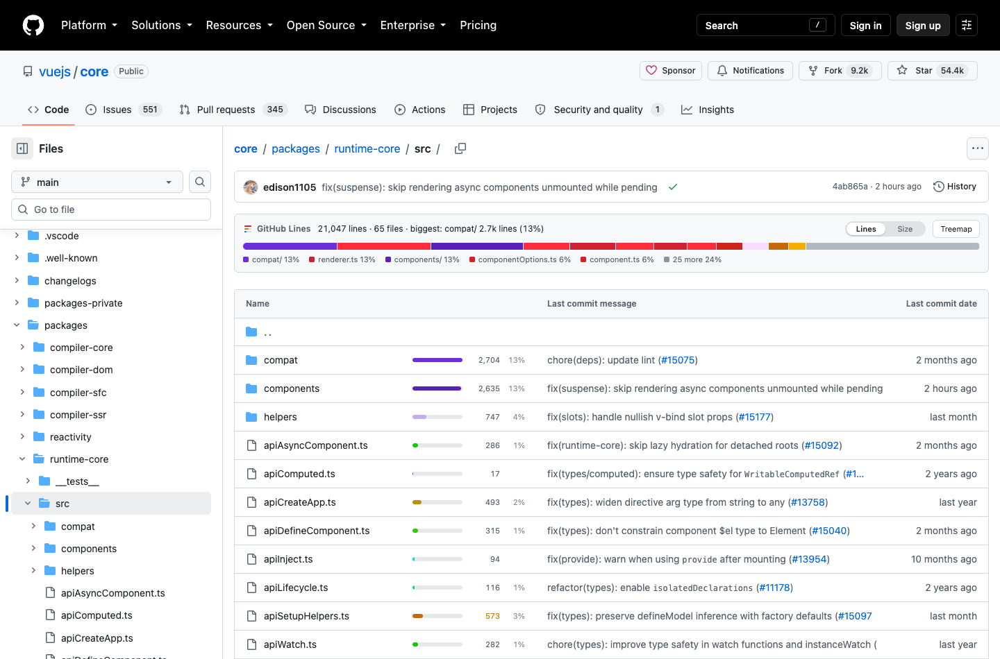
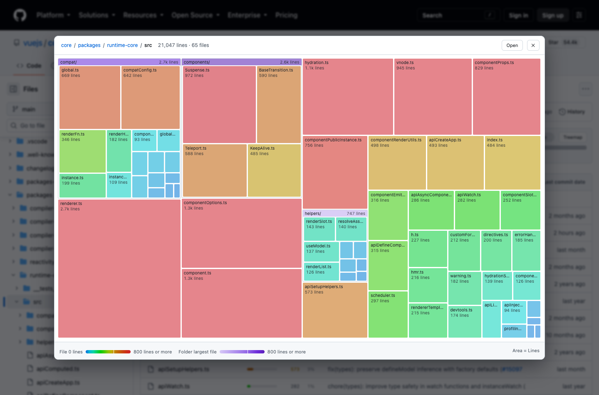

# GitHub Lines

[English](README.md)

GitHub のファイル一覧に、**そのディレクトリの中で各項目が行数の何割を占めるか**をバーで表示する Chrome 拡張です。

AI にコードを書かせていると、1 つのファイルだけが不釣り合いに膨らんでいきます。GitHub の一覧は名前しか出さないので、それに気づけません。クローンせずに、ブラウザの中で見えるようにします。

`apiSetupHelpers.ts` が 573 行で警告のしきい値に近いこと、`compat/` と `components/` がそれぞれディレクトリの 13% を占めていることが、ページを開いた時点で分かります。（画像は Vue の `runtime-core` パッケージです）

「Treemap」ボタンを押すと、**面積が行数**のビューに切り替わります。ディレクトリをクリックすると中に入れます。

## 導入

ビルドは不要です。5 分で終わります。

### 1. 拡張を読み込む

1. このリポジトリをクローンするか、[ZIP をダウンロード](https://github.com/ebi-oishii/github-lines/archive/refs/heads/main.zip)して展開する
2. `chrome://extensions` を開く
3. 右上の「デベロッパーモード」をオンにする
4. 「パッケージ化されていない拡張機能を読み込む」で、`manifest.json` のあるディレクトリを選ぶ

GitHub のリポジトリを開けば動いています。自分から行数を数えに行くことはないので、ファイル一覧の上に出る帯の「行数を取得」を押してください。

### 2. 設定画面を開く

`chrome://extensions` の GitHub Lines から「拡張機能のオプション」をクリックします。ツールバーにピン留めしているなら、アイコンを右クリック →「オプション」です。

設定は変更した時点で保存されます。保存ボタンはありません。

### 3. トークンを登録する（プライベートリポジトリに必要）

トークンなしでもパブリックリポジトリでは動きますが、GitHub API は未認証だと 1 時間に 60 リクエストです。トークンを登録すると 5,000 になり、プライベートリポジトリも読めます。

1. [fine-grained トークンを作成する](https://github.com/settings/personal-access-tokens/new)。必要な権限は `Repository permissions → Contents: Read-only` だけです
2. 設定画面の「アクセストークン」に貼り付ける
3. 「確認してオーナーを補完」を押す。そのトークンで実際に読めるアカウントと組織が埋まります

作成手順の詳細と、組織・SAML SSO での注意点は [トークン](docs/token.md) にあります。個人用と仕事用でアカウントを分けているなら、[オーナーごとにトークンを振り分けられます](docs/token.md#using-several-accounts)。

### 4. いつ数えるかを選ぶ

| モード | 挙動 | 向いている人 |
|---|---|---|
| 手動（既定） | 開いた時点では何も取得せず、ボタンを押したときに数える | 通りすがりに開いたページで API を消費したくない |
| 自動 | ページを開いた時点で数え始める | 常に実数が見たい |
| オフ | 推定のみ | 割合だけ分かればよい |

既定が手動なのは、通りすがりに開いただけのページで API の残量（トークンを登録するまで 1 時間に 60）を使わないためです。手動モードでは、各行のチェックボックスで取得対象を絞れます。[使い方](docs/usage.md#when-it-counts)を参照してください。

### 5. 表示言語（任意）

既定ではブラウザの言語に従います（英語または日本語）。設定画面の「表示 → 言語」で固定できます。

### 更新

クローンした場合は `git pull` のあと、`chrome://extensions` で GitHub Lines の再読み込みを押してください。開いたままの GitHub のタブは再読み込みが必要です。

## 表示の読み方

| 見えるもの | 意味 |
|---|---|
| バーの長さ | **そのディレクトリで最大の項目に対する比** — 先頭は常に最大まで伸びます |
| `52%` | ディレクトリ合計に対する**実際の割合** |
| `~1,204` | 推定値。実数はまだ取得していません |
| 青 → 緑 → 琥珀 → 赤 | 行数に応じて連続的に変化します（既定で 500 から琥珀、800 以上は赤。どちらも変更できます） |
| 淡い紫 → 濃い紫 | ディレクトリ。**その中で最大のファイル**に応じて濃くなります |
| | サイズ表示のときは、同じ配色をバイト数で読み替えます |
| `generated` `binary` | 数えていません |

残りは[使い方](docs/usage.md)にあります。

## ドキュメント

| | |
|---|---|
| [使い方](docs/usage.md) | 表示の読み方、各設定、除外、キャッシュと消費するリクエスト |
| [トークン](docs/token.md) | PAT の作成と登録、組織、SAML SSO |
| [困ったとき](docs/troubleshooting.md) | バーが出ない、行数が合わない、など |
| [API の利用と規約](docs/api-usage-and-terms.md) | GitHub の規約とレート制限に対するこの拡張の扱い |

ドキュメントは英語です。

## 制限

- `github.com` のみ（GitHub Enterprise Server は対象外）
- 「行」は `wc -l` が数えるものです。空行やコメントは区別しません
- Tree API が `truncated` を返すほど大きなリポジトリ（おおよそ 10 万ファイル）では、ネストしたディレクトリの合計が不完全になります。その旨は帯のステータスに出ます

## ライセンス

[Apache-2.0](LICENSE)
