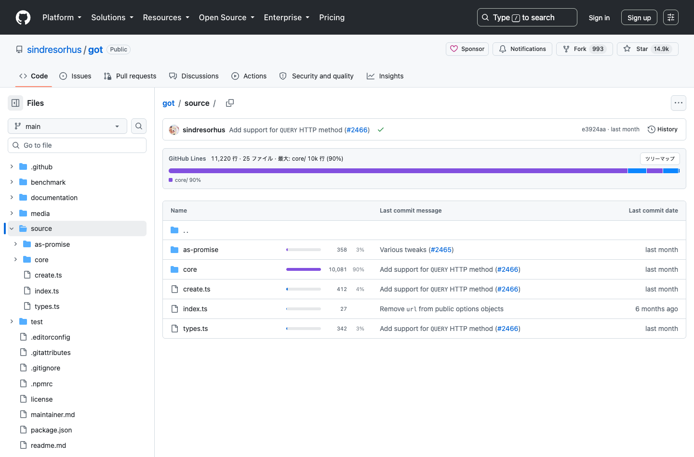

# GitHub Lines

GitHub のファイル一覧に、**そのディレクトリ内での行数の割合**をバーで表示する Chrome 拡張です。

AI にコードを書かせていると特定のファイルだけが肥大化しがちですが、GitHub の標準 UI は
ファイル名しか出さないため気づけません。clone せずに、ブラウザ上で一目で分かるようにします。

`core/` が 90% を占めていることも、`create.ts` が 412 行であることも、開いた瞬間に分かります。

「ツリーマップ」ボタンで面積 = 行数の俯瞰図に切り替わります。ディレクトリをクリックすると
その中へドリルダウンできます。

## インストール

ビルド不要です。

1. このリポジトリを clone するか、[ZIP をダウンロード](https://github.com/ebi-oishii/github-lines/archive/refs/heads/main.zip)して展開
2. `chrome://extensions` を開く
3. 右上の「デベロッパーモード」をオン
4. 「パッケージ化されていない拡張機能を読み込む」でこのディレクトリを選択

GitHub のリポジトリを開けばすぐ動きます。private リポジトリを見る場合や、
未認証の API 制限（60 回/時）に当たる場合は[トークンを設定](docs/token.md)してください。

## 表示の読み方

| 表示 | 意味 |
|---|---|
| バーの長さ | **そのディレクトリで最大の項目に対する相対値**。1 位が常に満タン |
| `52%` | ディレクトリ合計に占める**実際の割合** |
| `~1,204` | 推定値（まだ実行数を取得していない） |
| 青 / 黄 / 赤 | 通常 / 500 行以上 / 800 行以上（閾値は変更可） |
| `generated` `binary` | カウント対象外 |

詳しくは [使い方](docs/usage.md) を参照してください。

## ドキュメント

| | |
|---|---|
| [使い方](docs/usage.md) | 表示の読み方、設定項目、除外ルール、キャッシュと API 消費量 |
| [トークンの設定](docs/token.md) | PAT の作り方と登録手順、Organization / SAML SSO の注意点 |
| [困ったときは](docs/troubleshooting.md) | バーが出ない、行数が合わない、など |
| [API 利用と規約](docs/api-usage-and-terms.md) | GitHub の利用規約・レート制限に対する本拡張の扱い |
| [開発](docs/development.md) | テスト、フィクスチャ更新、コード構成 |

## 制限

- 対象は `github.com` のみ（GitHub Enterprise Server は未対応）
- 「行数」は `wc -l` 相当です。空行・コメントは区別しません
- 10 万ファイル超などで Tree API が `truncated` を返す場合、ネストしたディレクトリ合計は
  不完全になります（その旨をステータスに表示します）

## 既存拡張との違い

調べた範囲では、要件（ディレクトリ内の割合を一覧上で比較）を満たすものはありませんでした。

| 拡張 | 実際にやること |
|---|---|
| [harshjv/github-repo-size](https://github.com/harshjv/github-repo-size) | 一覧にサイズ列（バイト）。2025-08 にアーカイブ |
| [AminoffZ/github-repo-size](https://github.com/AminoffZ/github-repo-size) | popup でサイズ集計（バイト） |
| [Github Aid](https://chromewebstore.google.com/detail/github-aid-displays-repo/abfbcnoemiciiljhpngefacedfgebdcn) | ファイル / フォルダのバイト数 |
| [GitHub Code Counter](https://chromewebstore.google.com/detail/github-code-counter/lkmlkgijefhcbgpngkhmdhilfdffljhj) | popup で総 LOC とファイル別内訳 |
| [GitHub Tree Map](https://chromewebstore.google.com/detail/github-tree-map/aagofmkgihihajogoojeamnfgpgmehnn) | 階層のツリー**図**（面積は行数に非依存） |
| [github-better-line-counts](https://github.com/aklinker1/github-better-line-counts) | PR の diff から生成物を除外 |

`.gitattributes` の `linguist-generated` を除外に使う手法は github-better-line-counts から取り入れました。

## ライセンス

[MIT](LICENSE)
